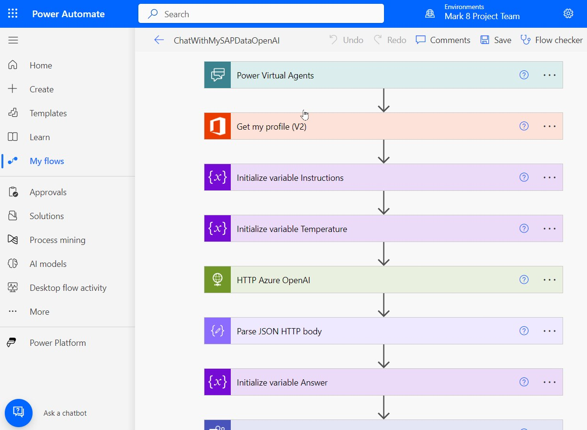
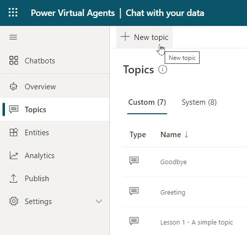
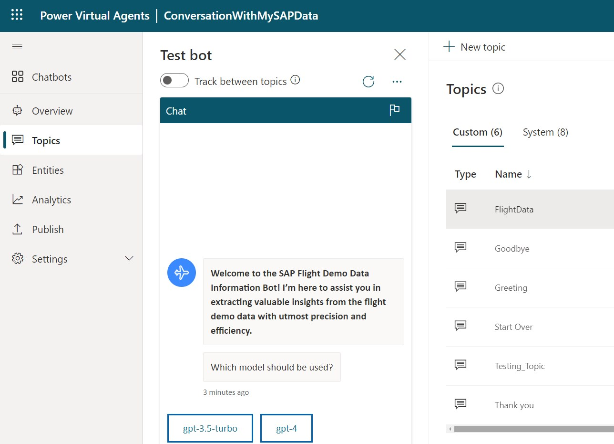

# Chat with your SAP Data or any data

# Note: this is work in progress

# Prerequesites

1. Power Platform
    1. Power Virtual Agent (PVA), to create the bot https://web.powerva.microsoft.com/
    1. Power Automate Flows: https://make.powerautomate.com/
    1. Recommended: 2 environments DEV and PROD
1. Function App (Premium) to run SQL code against the HANA DB  
    1. With system assigned identity, to enable access to DB secret in a key vault
    1. With VNET integration und outbound network access into a dedicated subnet from where access to the DB is possible
1. Another Function App to convert the SQL Output in CSV into other formats like JSON, MARKDOWN or HTML
1. Generate the SAP Flight Demo Data or try directly on SAP business data
1. A DB user with read access to the required tables
1. Azure OpenAI Service URI and API-KEY

# Setup the solution

## Setup the Flow

Import the flow first before setting up the bot.  

Here you can download the flow as zip file: [Download the Power Automate Flow](flow/ChatWithMySAPDataOpenAI_Flow_Export_1_0_0_1.zip)  

Then import the flow:  

  

Make required adjustments within the flow, adapt URIs, api-key, etc.  

  

## Setup the Bot

Create a new bot in https://web.powerva.microsoft.com/  

  

   

In the newly crated Bot create an additional topic:   

   

Open the code editor:   

   

Paste the code into this new topic.    

Here you can download the bot code as template for the new bot topic: [Download The FlightDemo Topic](pva/pva.yaml)  

After adapting the broken references it can be used in your environment.  

  

## Azure function to execute SQL on the DB

For HANA DB we start hdbsql from an Azure function.   
Implement this Azure Function to call hdbsql and execute the SQL code in the HANA DB: [Azure Function to call hdbsql](https://github.com/mimergel/saphanasqlfunction)   

I haven't had the opportunity to explore alternative database vendors yet. However, it's highly probable that this concept can be easily applied to various SAP database systems, such as Oracle, DB2, MS SQL, MAXDB, and Sybase.   

Similarly, I'm confident that it can also be effectively utilized with non-SAP databases.   

## Azure function to convert SQL Output in CSV into JSON, MARKDOWN or HTML

Implement this Azure Function for the conversion: [Azure Function to convert CSV](https://github.com/mimergel/sqloutputcsv_to_json_html_markdown)   

