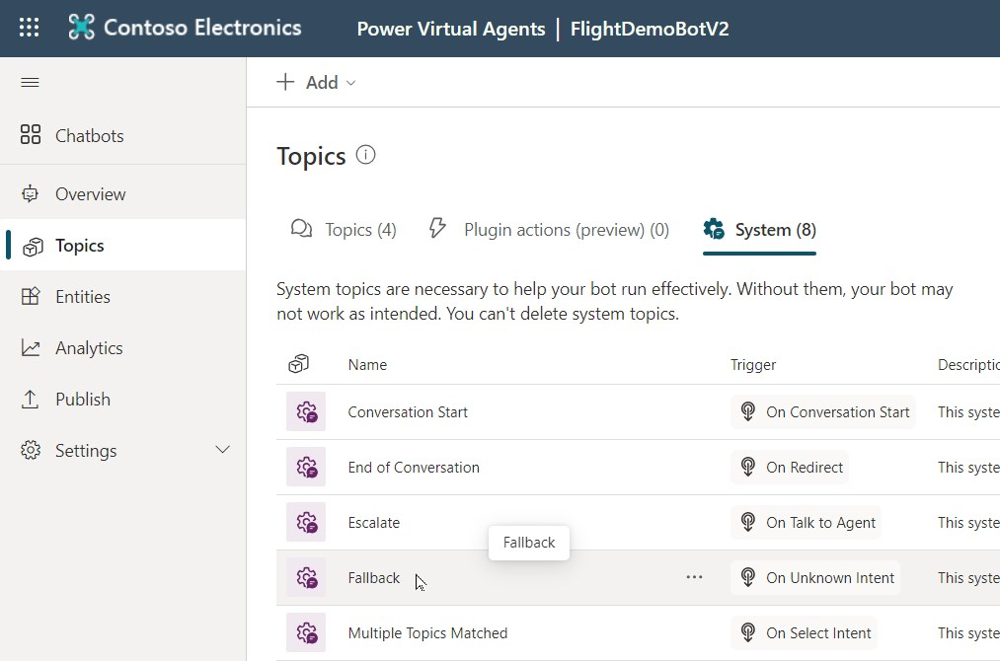

# Chat with your SAP Data (or any data)

Integrate a ChatGPT-like experience directly into Microsoft Teams, enabling users to ask any question about their SAP data. With all data and interactions securely contained within your private Power Platform environment and Azure Subscription, engage in confidential conversations using your business data, ensuring privacy and security at every step.

**Architecture**

**Chat examples**

# Prerequesites

1. Power Platform 
    - Power Virtual Agent (PVA), to create the bot https://web.powerva.microsoft.com/
    - Power Automate Flows: https://make.powerautomate.com/
    - Recommended for productive use is separated DEV and PROD environments
    - Trial license: https://learn.microsoft.com/en-us/power-apps/maker/signup-for-powerapps
1. Azure Subscription
    - Azure Trial: https://azure.microsoft.com/en-us/free
1. Azure OpenAI Service 
    - Deployment Guide: https://learn.microsoft.com/en-us/azure/ai-services/openai/how-to/create-resource?pivots=web-portal
    - Request Access to OpenAI as described. Request only Text & code models.
1. Function App (Premium) 
    1. To run SQL code against the HANA DB
        - With a system assigned identity, to enable access to the DB secret in a key vault
        - With VNET integration und outbound network access into a dedicated subnet from where access to the DB is possible
    1. To convert the SQL Output in CSV into other formats like JSON, MARKDOWN or HTML
1. Generate the SAP Flight Demo Data or try directly on SAP business data
    - https://help.sap.com/docs/SUPPORT_CONTENT/abap/3353524003.html
1. A DB user with read access to the required tables

# Setup the Solution

## Azure OpenAI Service 

- Follow this documentation: https://learn.microsoft.com/en-us/azure/ai-services/openai/how-to/create-resource?pivots=web-portal   
- Once the OpenAI Service is deployed go to Models and deploy the gpt-35-turbo model.  
- Retrieve your endpoint URL and Key in "Chat Playground" -> "View code".

## Setup the Power Automate Flow (Flow)

- Login to: https://make.powerautomate.com/.
- Go to Solutions and import the Power Automate Flow.
- Here you can download the flow as zip file: [Download the Power Automate Flow](https://github.com/mimergel/chat_with_your_sap_data/blob/main/flow/FlightDemoBotV2_1_0_0_6.zip)

      

 

**Flow Screenshots**

 

|  |  |

 

  

  

## Adapt the HTTP Connectors in the Flow

- Get your Azure OpenAI URL and API-Key from the Azure Open AI Service Chat playground.

      

- URI example: https://[your endpoint].openai.azure.com/openai/deployments/[deployed model name]]/chat/completions?api-version=2023-07-01-preview

- Edit the Flow
    - Enter the URI and KEY in the respective fields of the HTTP Connectors for Azure OpenAI. There are 2 HTTP Connectors using Azure OpenAI: 
        - HTTP Azure OpenAI
        - HTTP create chart.js data
    - Adapt: 
        - URIs &
        - api-keys

      

For now you can enter URI and key in clear text. For later production use it's recommended to configure these as secrets and put references to the secrets like seen in the screen shot.  

- Change in the same way the following 3 HTTP Connectors:
    - HTTP hdbsql
    - HTTP csv to markdown
    - HTTP csv to json

      

 

Note that the key is here part of queries section and is called "code".

## Setup the Bot

- Create a new bot in https://web.powerva.microsoft.com/  

      
     
      

       

- In the fallback topic paste the code from the provided fallback.yaml file.

- Download the fallback topic code here: [fallback.yaml](pva/fallback.yaml)  

- Open the fallback topic in your bot

       

- Open the code editor and paste the code.

       

   

## Azure function to execute SQL on the DB

For HANA DB we start hdbsql from an Azure function.   
Implement this Azure Function to call hdbsql and execute the SQL code in the HANA DB: [Azure Function to call hdbsql](https://github.com/mimergel/saphanasqlfunction)   

I haven't had the opportunity to explore alternative database vendors. I'm sure this concept can be applied to any SAP database systems, such as Oracle, DB2, MS SQL, MAXDB, and Sybase.   

Similarly, I'm sure that it can also be effectively utilized with Non-SAP databases.   
  

## Azure function to convert SQL Output in CSV into JSON and MARKDOWN

Implement this Azure Function for the conversion: [Azure Function to convert CSV](https://github.com/mimergel/sqloutputcsv_to_json_html_markdown)   

## Disclaimer

THE CONTENT OF THIS REPOSITORY IS PROVIDED AS IS WITHOUT WARRANTY OF ANY KIND, EITHER EXPRESS OR IMPLIED, INCLUDING ANY IMPLIED WARRANTIES OF FITNESS FOR A PARTICULAR PURPOSE, MERCHANTABILITY, OR NON-INFRINGEMENT.